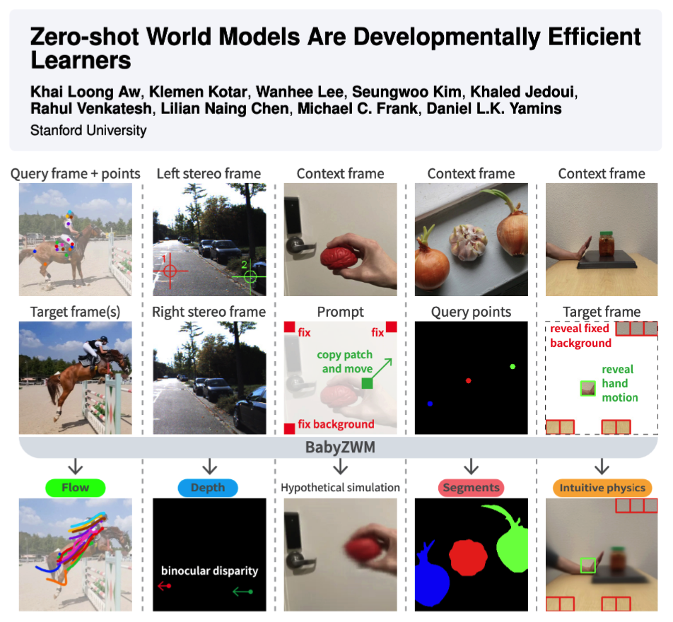
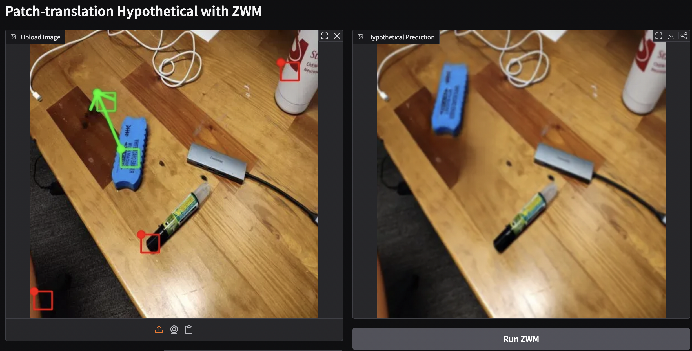

# ZWM
Code for the paper "Zero-shot World Models Are Developmentally Efficient Learners"

<p align="center">
  <a href="https://arxiv.org/abs/2604.10333">
    
  </a>
  <a href="https://huggingface.co/awwkl/models">
    
  </a>
</p>

<p align="center">
  
</p>

Today's best AI needs orders of magnitude more data than a human child to achieve visual competence. We introduce the Zero-shot World Model (ZWM), an approach that substantially narrows this gap. Even when trained on a single child's visual experience, BabyZWM matches state-of-the-art models on diverse visual-cognitive tasks – with no task-specific training, i.e., zero-shot. Our work presents a blueprint for efficient and flexible learning from human-scale data, advancing a path toward data-efficient AI systems.

## How it works

ZWM has three key principles:

1. ZWM starts with a masked autoencoder trained with sparse "temporally-factored" masking, creating a predictor that flexibly separates visual appearance from underlying dynamics.
2. The core of ZWM is the idea of *zero-shot prompting* the predictor via "approximate causal inference": perturb the input, make a prediction, then compare against unperturbed inputs/predictions. E.g., to segment an object, simply predict what happens if we move one patch of it, then compare it against the unperturbed input to see which pixels moved together.
3. Compositions of prompts allow the extraction of interpretable and increasingly abstract visual structures, building a computational graph of visual abstractions.

## System requirements

- **OS**: Linux (tested on Ubuntu 20.04, kernel 5.4). Should also work on other Linux distributions; not tested on macOS or Windows.
- **Python**: 3.10
- **GPU**: NVIDIA GPU required for training and recommended for inference. Reference hardware: NVIDIA A40 (48 GB) with CUDA driver ≥ 12.4. Other modern NVIDIA GPUs with bfloat16 support (A100, H100, RTX 30/40 series, etc.) should also work.
- **VRAM**: ~2–3 GB for 170M inference (the demo); ~14 GB peak for the 170M training smoke test (`per_device_batch_size=8`, bfloat16); a single 16 GB GPU is sufficient for both. Replicating the full 170M / 1B BabyView training runs uses an 8-GPU node at the recipe's batch size.
- **Dependencies**: full pinned list in [requirements.txt](requirements.txt); high-level summary in [SOFTWARE.md](SOFTWARE.md).

## Installation

```bash
git clone https://github.com/awwkl/ZWM.git
cd ZWM

# Create a fresh conda env (recommended)
conda create -n zwm python=3.10 -y
conda activate zwm

# Install ZWM and its dependencies
pip install -e .
```

If your CUDA driver is older than 12.4, install a CUDA-matched PyTorch build from [pytorch.org](https://pytorch.org/get-started/locally/) before running `pip install -e .`.

Verify the install:
```bash
python -c "from zwm.zwm_predictor import ZWMPredictor; print('ok')"
```

Typical install time on a normal desktop workstation with a fast network: ~5–10 minutes, dominated by the PyTorch + CUDA wheel download (~3 GB). On a slower (~10 Mbps) home connection, expect closer to 30–45 minutes.

## Repository layout

```
ZWM/
├── zwm/                  # Python package: model, training, inference
│   ├── train.py          #   entry point for training
│   ├── zwm_predictor.py  #   ZWMPredictor — factual + hypothetical inference API
│   ├── inv/              #   batched-inference scripts (e.g. factual prediction)
│   ├── data/             #   dataset + patch-sequence loaders
│   ├── utils/            #   model wrapper, sequence construction, viz helpers
│   └── config.py         #   ZWM_170MConfig, ZWM_1BConfig
├── scripts/              # Training replication recipes + HF download utilities
├── demos/                # Reviewer-facing demos (Gradio, inference, smoke test)
├── data/demo_videos/     # Bundled CC-BY clips for the inference demo
├── out/                  # Model checkpoints (downloaded or trained)
├── viz/                  # Inference visualization outputs
├── requirements.txt      # Pinned dependencies
├── SOFTWARE.md           # Software policy / version manifest
└── LICENSE               # MIT
```

## Model zoo

| HF repo | Training data | Params | Resolution |
|---|---|---|---|
| [`awwkl/zwm-bvd-170m`](https://huggingface.co/awwkl/zwm-bvd-170m) | BigVideoDataset | 170M | 256 |
| [`awwkl/zwm-bvd-1b`](https://huggingface.co/awwkl/zwm-bvd-1b) | BigVideoDataset | 1B | 256 |
| [`awwkl/zwm-kinetics-170m`](https://huggingface.co/awwkl/zwm-kinetics-170m) | Kinetics-400 | 170M | 256 |
| [`awwkl/zwm-kinetics-1b`](https://huggingface.co/awwkl/zwm-kinetics-1b) | Kinetics-400 | 1B | 256 |
| [`awwkl/zwm-babyview-170m`](https://huggingface.co/awwkl/zwm-babyview-170m) | BabyView | 170M | 256 |
| [`awwkl/zwm-babyview-1b`](https://huggingface.co/awwkl/zwm-babyview-1b) | BabyView | 1B | 256 |

Download a checkpoint into `./out/`:
```bash
python scripts/hf_model_download.py awwkl/zwm-bvd-170m
```

This places the file at `out/awwkl/zwm-bvd-170m/model.pt`. Throughout the rest of the README, `ZWMPredictor("awwkl/zwm-bvd-170m/model.pt")` and equivalent `--model_name` arguments refer to this relative path under `out/` — not a HuggingFace ID directly.

## Quickstart — Hypothetical prediction

Predict a future frame by moving patches:

```python
import numpy as np
from PIL import Image
from zwm.zwm_predictor import ZWMPredictor

predictor = ZWMPredictor("awwkl/zwm-bvd-170m/model.pt")
frame0 = Image.open("demos/assets/examples/bag.jpg").convert("RGB")

# Each row is (x1, y1, x2, y2) in pixel coords at the model resolution (256).
# With patch_size_move_mult=2, a 2x2 block of 8x8 patches (16x16 px) starting
# at (120, 120) is moved so its top-left lands at (140, 100).
move_points = np.array([[120, 120, 140, 100]])

out = predictor.hypothetical_prediction(frame0, move_points, patch_size_move_mult=2)
out["frame1_pred_pil"].save("hypothetical.png")
```

<p align="center">
  
</p>

## Quickstart — Factual prediction

Reconstruct masked patches in `frame1` given `frame0` and a few visible hints. The repo bundles three short CC-BY 3.0 clips in [data/demo_videos/](data/demo_videos/) (excerpts of Blender's *Tears of Steel*, *Caminandes 1*, and *Sintel*) so you can run this end-to-end immediately:

```bash
bash demos/run_inference_demo.sh
```

The wrapper script auto-downloads the HuggingFace checkpoint into `out/` on first run.

**Expected output:** Saves a 5-panel visualization for each sampled frame pair to `viz/zwm_factual_predictions/<model_name>/iter_*.png` (panels: frame 0, frame 1 ground truth, predicted patches, predicted plus unmasked patches, frame 1 GT with mask), plus `loss_value.txt` with the mean MSE between predicted and ground-truth frame 1.

**Expected run time:** ~2 minutes for 10 samples on a single NVIDIA A40 (similar on other modern NVIDIA GPUs with bfloat16 support, e.g. RTX 30/40-series consumer GPUs typical of a desktop workstation), plus a one-time HuggingFace checkpoint download on first run (~30 s for the 170M model). CPU-only execution is not supported.

### Raw CLI

The wrapper script above is equivalent to:

```bash
python -m zwm.inv.inv_zwm_factual_prediction \
    --videos_dir data/demo_videos/ \
    --n_samples_to_eval 10 \
    --num_viz 10 \
    --model_name awwkl/zwm-bvd-170m/model.pt \
    --frame1_mask_ratio 0.90
```

With only 3 bundled clips, the script cycles over them with replacement; each sample uses a randomly chosen frame pair (gap in [5, 16) frames) so 10 samples surface a range of gap sizes. To run on your own data, point `--videos_dir` at any directory of `.mp4` files (recursively globbed). See [zwm/inv/inv_zwm_factual_prediction.py](zwm/inv/inv_zwm_factual_prediction.py) for the full implementation.

### Python API

To use ZWM as a library on your own frames:

```python
from PIL import Image
from zwm.zwm_predictor import ZWMPredictor

predictor = ZWMPredictor("awwkl/zwm-bvd-170m/model.pt")
# Replace these with two consecutive frames from your own video.
frame0 = Image.open("frame0.jpg").convert("RGB")
frame1 = Image.open("frame1.jpg").convert("RGB")

out = predictor.factual_prediction(frame0, frame1, frame_gap=10, mask_ratio=0.9)
out["frame1_pred_pil"].save("factual_prediction.png")
```

## Interactive Gradio demo

Launch a browser UI for hypothetical prediction — click an image to mark a patch, drag to specify where it should move, and watch the model fill in the rest:

```bash
python -m demos.gradio_hypothetical --model_name awwkl/zwm-bvd-170m/model.pt
```

## Training

Training entry point is [zwm/train.py](zwm/train.py).

To replicate the released BabyView-170M model ([`awwkl/zwm-babyview-170m`](https://huggingface.co/awwkl/zwm-babyview-170m)) end-to-end, edit `--train_data_dir` in [scripts/train_zwm_babyview_170m.sh](scripts/train_zwm_babyview_170m.sh) to point at your local copy of the BabyView 10s 256p clips, then run:

```bash
bash scripts/train_zwm_babyview_170m.sh
```

This launches an 8-GPU torchrun with the exact recipe used to produce the released checkpoint (170M params, batch size 512, 200k iters, bfloat16, A40 reference hardware). The 1B variant uses the same recipe with a smaller `--per_device_batch_size`; see [scripts/train_zwm_babyview_1b.sh](scripts/train_zwm_babyview_1b.sh).

The BabyView dataset (Long et al., 2024; https://doi.org/10.48550/arXiv.2406.10447) is hosted by Databrary at https://nyu.databrary.org/volume/1882 and https://nyu.databrary.org/volume/1856; access is granted to authorised researchers under Databrary's standard data-use agreement.

Large-scale training is not the focus of this release — we recommend starting from a released checkpoint for most downstream use.

### Training smoke test

To verify the training loop runs end-to-end on your machine without setting up a real dataset:

```bash
bash demos/run_training_smoketest.sh
```

This runs 301 iterations of the 170M config on the bundled clips in [data/demo_videos/](data/demo_videos/) at `--per_device_batch_size 8`, logs loss every 10 iterations, and saves checkpoints at iters 100, 200, 300 to `out/zwm_smoketest/`. Expected run time: ~10–15 minutes on a single NVIDIA A40. This is a smoke test, not a usable training run.

## Citation

If you use this code/model in your research, please cite it as follows:

```bibtex
@misc{aw2026zeroshotworldmodelsdevelopmentally,
      title={Zero-shot World Models Are Developmentally Efficient Learners}, 
      author={Khai Loong Aw and Klemen Kotar and Wanhee Lee and Seungwoo Kim and Khaled Jedoui and Rahul Venkatesh and Lilian Naing Chen and Michael C. Frank and Daniel L. K. Yamins},
      year={2026},
      eprint={2604.10333},
      archivePrefix={arXiv},
      primaryClass={cs.AI},
      url={https://arxiv.org/abs/2604.10333}, 
}
```

## License

Released under the MIT License. See [LICENSE](LICENSE).